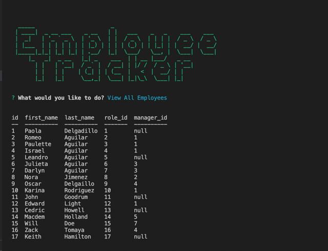

# Employee Tracker

## Description

The objective of this application was to build a command-line application from scratch to manage a company's employee database, using Node.js, Inquirer, and MySQL.

## Table of Contents (Optional)

- [Installation](#installation)
- [Usage](#usage)
- [Credits](#credits)
- [License](#license)

## Installation

To use this app you will need to download and install the terminal for mac or gitbash for windows. You may also need to install node.js and npm using the terminal. You will open the project in the code editor of your choice and then open the terminal and type "npm install" or "npm i" to install all the dependencies required. Finally you will be able to start the app typing "npm start" or "node index.js" on your terminal or gitbash.
What are the steps required to install your project? Provide a step-by-step description of how to get the development environment running.

## Usage

